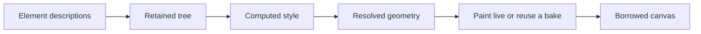

# Compose core implementation

This directory implements `SigilComposeCore`: immutable descriptions become
a retained tree, resolved boxes and pixels on a borrowed canvas. Public
headers live under `include/sigilcompose/core/`. The implementation is
organized by the question each part answers.

| Directory | Question | Owns |
|---|---|---|
| `description/` | What did the author state? | Element storage, factories, values, facts and operator declarations. Fluent setters live in `description/verbs/`. |
| `style/` | What is in force at this node? | Selectors, sheets, inheritance, custom properties and computed style. |
| `runtime/` | What survives the next description? | Composer lifetime, instances, reconciliation, transitions and queries. |
| `layout/` | Where does the content belong? | Yoga styles and measurement, arranging and adding operators, text flow, threading and borrowed geometry. |
| `paint/` | What should be drawn, and in what order? | The stacking walk, content dispatch, transforms, paint bounds, coverage, material lowering, tiled pictures, instanced leaves and profiling. |
| `cache/` | Can that drawing be reused? | Volatility, scalar stability, picture, texture, group, split and promotion tiers; pattern and stamp bakes. |

These are private implementation concerns within one target. They share
the retained tree and its orchestration context; a directory is not an
independently usable library. The public feature targets separate the
kernel from typography, brush execution, kits and hosted surfaces.

## Reading path

Start with the public `Composer.h` and `Element.h`. Then read:

1. `runtime/Composer.cpp`: the host's render, draw and invalidation gates.
2. `description/ComposeInternal.h`: the value being described.
3. `runtime/Instance.h`: the mutable state retained for that value.
4. `runtime/ReconcileHost.cpp`: the operations the generic reconciler
   performs when descriptions or child identity change.
5. `style/Cascade.cpp`: the inherited and declared values resolved before
   layout.
6. `layout/Layout.cpp`: the phase schedule and its bounded settling loop.
7. `paint/StackingPainter.cpp`: the node walk and dispatch into the cache
   tiers.

For a defect in one feature, start at the directory that owns the answer.
A stale image belongs to `cache/`; incorrect dimensions belong to
`layout/`; an inherited ink belongs to `style/`; a wrong surviving child
belongs to `runtime/`. A fluent setter belongs to `description/verbs/`.

## Data and phase boundaries

Descriptions are copy-on-write values. Reconciliation may replace an
instance's description, but it must not mutate a value held by an author
or another composer. Identity matching and memo comparison belong to
SigilCore's reconciler; Yoga attachment, text state and paint invalidation
belong to its Compose host.

The cascade resolves typography, layout lengths and paint declarations
into retained computed state. Layout measures that state and settles
geometry readers and writers. Arrangers borrow one span of child records,
write placements in place, and restart each settlement round from authored
flex rectangles at the current container extent. Outer placements settle
before nested scopes measure their inputs; independent scopes share that
measurement pass. Their Yoga outputs do not become inputs to another
round. Paint consumes the settled geometry; a
paint-only binding changes a transform or paint without relayout.

Scene containers own planar lighting independently of layout operators.
The source declarations below a scene are collected before its receivers
paint, stopping at nested scenes. Source leaves have no layout, painted
content or hit region. Their resolved transforms and light values feed
the scene context; a change invalidates the receivers that used it and
their containing recordings. A receiver's complete lighting declaration
replaces that context. Descriptions carry the source and environment
values; the retained runtime owns resolved contexts and dependencies.

The stacking painter owns traversal and compositing. Cache tiers answer
whether they painted a node; declining a bake returns to live paint. A
failed replacement cannot reuse pixels taken under different geometry.
Cache policy and stability proofs come from SigilCore; Skia recordings,
surfaces and sampling are Compose's executor policy.
Static sampled paints retain their source until the drawing destination is
known. Changing its pixel format, GPU recorder or recording context drops
held pictures and pixel bakes before binding those sources again.

A retained picture carries a pending visit when an eligible group below it
needs another observation before baking. The next draw revisits that group
independently of matrix stability, and the host stays active for that draw.
Pixel layers and coverage traces isolate pending visits within their own
paint; permanent bake refusals do not request another frame.

Pixel bakes retain the owning draw's destination precision and color space,
with premultiplied alpha for transparent intermediate surfaces. A destination
format change drops both images and the recordings that contain them. Picture
canvases have no pixel format, so nested bakes use the owning draw's format.
Shared cell sheets and brush art keep one bake for the last requested format.
One-shot snapshots have no destination; any pixel bakes they contain default
to N32. Draw through a composer onto a float canvas when retaining HDR values.

## Ownership

The host owns the motion engine, font context, canvas and frame cadence.
The engine and font context must outlive the composer; the canvas is
borrowed for each draw. The composer owns its retained instances, and
each instance owns its children, Yoga node and cached rendering state.
Yoga child attachments mirror the retained list; they are not another
owner of those children.

`runtime/ComposerImpl.h` is the shared orchestration context and phase
method declaration map. `runtime/ComposeRuntime.h` gathers that context,
the instance and the transform vocabulary. Translation units include the
private subject they use, spelling a cross-directory dependency as, for
example, `runtime/ComposeRuntime.h` or `paint/PaintPass.h`.

Brush and typography executors read the kernel's private seams; the bevel
kit also uses its material lowering helpers. Hosted draw and texture
features use public headers. The kernel does not include its kits,
Sketchbook or a device backend. Geometry, materials, paragraph layout and
motion remain values and services supplied by their originating libraries.

## Adding or changing a feature

Put the author declaration in `description/`, its inherited resolution in
`style/`, geometry work in `layout/` and drawing work in `paint/`. Reuse
decisions and bake executors belong in `cache/`. Add retained state where
its lifetime is owned, rather than to a description or process global for
convenience.

Extend the existing public seam when a brush or typography executor needs
new behavior. Keep a stock recipe in its kit. A new internal directory
does not justify a new public target; a reusable concern with a separate
consumer and an explicit dependency contract does.

Tests remain under `test/`, benchmarks under `bench/` and shader bodies
under `shaders/`. Their build declarations are explicit in `CMakeLists.txt`.
Tests assert retained behavior and resource counts. Benchmarks measure
scaling and time; reference plates own visual identity.
